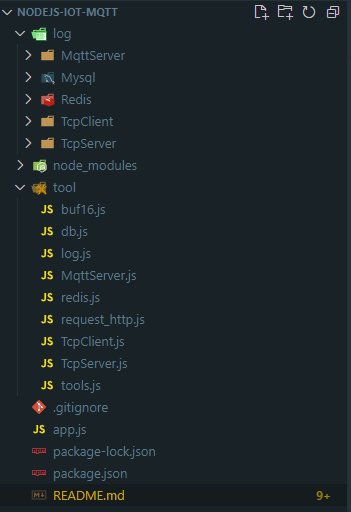

# nodejs-iot-mqtt
 
基于nodejs的网络***物联网***服务，包含```MQTT、TCP```服务端与客户端连接。包含日志存储、登录鉴权、编码解析，封装redis、mysql连接函数等。


### 依赖环境

* nodejs
* redis

### 演示


#### 使用 

``` javascript
import MQTT from "./tool/MqttServer.js"   

// 创建 mqtt服务端
const mt = new MQTT({
    mtport:1883,   // mqtt 服务端口
    wsport:3001    // mqtt-websocket 服务端口
})

/**
 * 监听mqtt主题订阅
 * @param {string} name 用户名称
 * @param {string} insertId 报错日志到数据库后返回的id
 * @param {string} message 消息内容
 * @param {string} topic 主题
 */
mt.listening(function(name,insertId,message,topic){
    // 验证数据类型 是否为json
    if(validator.isJSON(message)){ //是
        message = JSON.parse(message)
        loggerMqttServer.trace(`${topic}主题收到MQTT客户 ${name} 的消息：${JSON.stringify(message)}`)
    }else{ // 否
        loggerMqttServer.trace(`${topic}主题收到MQTT客户 ${name} 的消息：${message}`)
    }
    // ...
})


// 模拟数据库数据
let cameras = [{device_type: 1, status: 1, name: '测试车道', device_name: 'yanfa_test', device_ip: '192.168.123.123',mqtt_status: 0,status_time: null,rtsp_url: ''}];
let ServerObj = {} // 缓存对象：存储 tcpServer设备(摄像头)
for (const item of cameras) {
    // 循环创建 tcp客户端连接
    ServerObj[item.device_name] = new TcpClient({device_name:item.device_name,port:8131,ip:item.device_ip},function(){
        loggerTcpClient.trace(`摄像头 ${item.device_name} 连接成功`);
        // 监听摄像头返回结果
        ServerObj[item.device_name].getMsg(item.device_name,function(device_name,result){
            let data = result.slice(8)
            if(data.length>8){
                let msg = JSON.parse(data)
                // 控制台打印操作结果
                console.log(`${device_name}成功获取摄像头信息：`,msg);
            }
        })
    })
}
```

#### 日志配置

```js

import log4js from "log4js" // 引入log4js模块

// 配置日志类型
log4js.configure({
    appenders: {
        console: { type: 'console' }, // 添加控制台输出器
        MqttServer: { type: 'dateFile', filename: 'log/MqttServer/MqttServer', pattern: 'yyyy_MM_dd.log', alwaysIncludePattern: true },
        TcpServer: { type: 'dateFile', filename: 'log/TcpServer/TcpServer', pattern: 'yyyy_MM_dd.log', alwaysIncludePattern: true },
        TcpClient: { type: 'dateFile', filename: 'log/TcpClient/TcpClient', pattern: 'yyyy_MM_dd.log', alwaysIncludePattern: true },
        Redis: { type: 'dateFile', filename: 'log/Redis/Redis', pattern: 'yyyy_MM_dd.log', alwaysIncludePattern: true },
        Mysql: { type: 'dateFile', filename: 'log/Mysql/Mysql', pattern: 'yyyy_MM_dd.log', alwaysIncludePattern: true },
    },
    categories: {
        default: { appenders: ["console","MqttServer"], level: "trace" }, // "console" 同时输出到控制台和文件
        TcpServer: { appenders: ["console","TcpServer"], level: "trace" },
        TcpClient: { appenders: ["console","TcpClient"], level: "trace" },
        Redis: { appenders: ["console","Redis"], level: "trace" },
        Mysql: { appenders: ["console","Mysql"], level: "trace" },
    }
});

// 定义常量
const loggerMqttServer = log4js.getLogger("MqttServer");
const loggerTcpServer = log4js.getLogger("TcpServer");
const loggerTcpClient = log4js.getLogger("TcpClient");
const loggerRedis = log4js.getLogger("Redis");
const loggerMysql = log4js.getLogger("Mysql");

// 导出常量
export {
    loggerMqttServer,loggerTcpServer,loggerTcpClient,loggerRedis,loggerMysql
}

// logger.trace("跟踪");
// logger.debug("调试");
// logger.info("信息");
// logger.warn("警告");
// logger.error("错误");
// logger.fatal("致命的");
```

#### 目录结构



